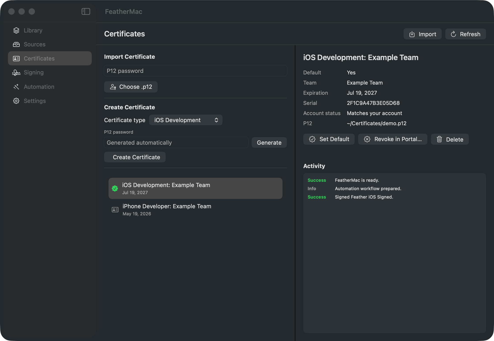
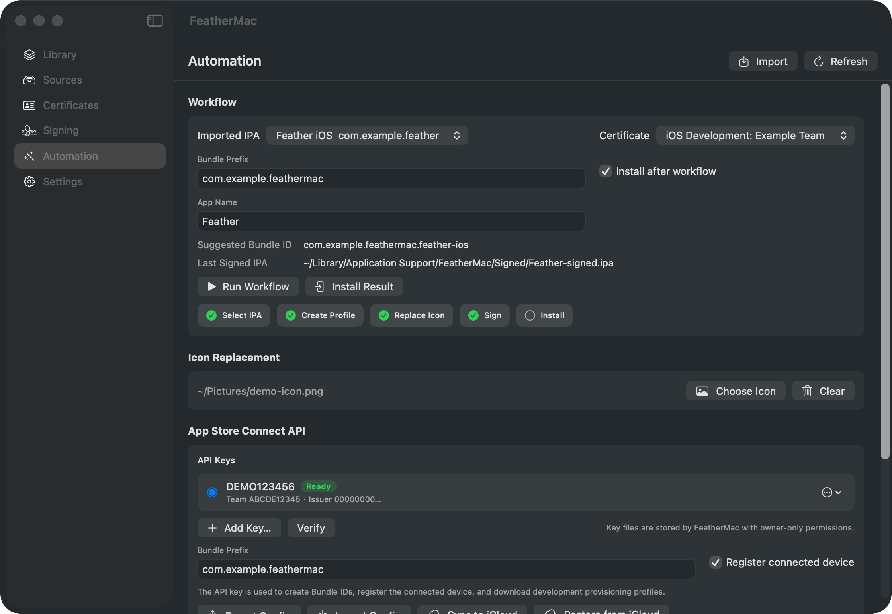
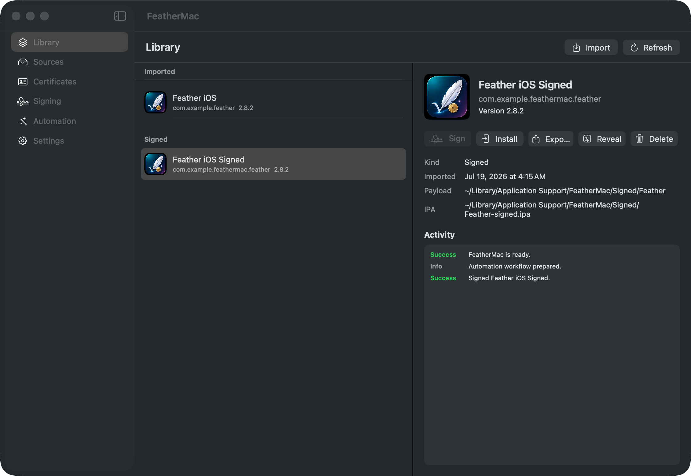
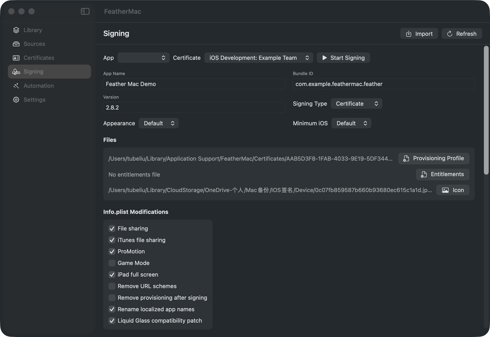

<p align="center">
  
</p>

<h1 align="center">FeatherMac</h1>

<p align="center">
  <strong>English</strong> | <a href="README.zh-CN.md">简体中文</a>
</p>

<p align="center">
  
  
  
</p>

<p align="center">
  Sign iOS apps and install them on your own device — from one native Mac app, without opening Xcode.
</p>

<p align="center">
  <a href="https://github.com/TubeLiu/FeatherMac/releases/latest"><strong>Download the latest release</strong></a>
</p>

---

If you have a paid Apple Developer account and you sideload apps onto your own iPhone, you know the routine: open Xcode to make a certificate, go to the developer portal for a bundle ID, register the device, download a provisioning profile, find a signing tool, then find another tool to install the result. Six places, and none of them talk to each other.

FeatherMac does the whole chain in one window. Import an IPA, and it creates the certificate, registers your device, generates the provisioning profile, signs, and installs — while showing you what it is doing at each step.

**This is for people who already pay for the Apple Developer Program.** Certificates come from Apple's App Store Connect API, which free (Personal Team) accounts cannot use. If you are looking for 7-day signing with a free Apple ID, this is not that tool.

## Screenshots

### Certificates

Create, renew, and revoke signing certificates without opening Xcode. Each certificate shows its serial number and whether it still exists in your Apple account.



### Automation



### Library



### Signing



## Highlights

- **Certificates without Xcode.** Create an iOS Development certificate from inside the app. The private key is generated on your Mac and never leaves it — only the certificate request is uploaded. When Apple's certificate limit is reached, FeatherMac lists what you have and offers to revoke one and continue. Expired certificates get a one-click renewal.
- **A setup wizard that catches mistakes early.** Connecting your Apple account takes four steps. The Key ID is read from the `AuthKey_*.p8` file name, the file is checked before anything is sent to Apple, and when Apple rejects your credentials you are told which of the three values is wrong rather than shown a raw error code.
- **Several API keys, switchable.** Useful when you work across accounts or teams. Key files are copied into FeatherMac's own data directory with owner-only permissions, so cleaning out your Downloads folder does not break signing later.
- **One click from IPA to installed app.** The Automation page runs the full sequence: pick an app, create or reuse a provisioning profile, replace the icon, sign, install. Re-signing after a certificate renewal is the same one click. A `--workflow` command-line mode runs the same pipeline for scripting.
- **The signing options you actually reach for.** Rename the app, rewrite its bundle identifier, replace the icon, inject tweaks and dylibs, toggle Info.plist capabilities, strip URL schemes.
- **App sources.** Browse AltStore-style catalogs and APT repositories, download apps, and keep every signed result for reinstalling later.
- **Credentials handled properly.** p12 passwords go in your keychain, not a config file — a stolen `cert.p12` is useless without one. Data directories are owner-only. Exporting your configuration warns you first that the file contains your API private key in plain text.
- **English and Simplified Chinese** throughout.

## Automation workflow


1. Import an IPA in **Library**.
2. In **Automation**, run the App Store Connect setup wizard and import your `.p8` key.
3. In **Certificates**, create a development certificate — or import an existing `.p12`.
4. Set a bundle prefix such as `com.example`.
5. Pick the IPA and certificate, then run the workflow.

FeatherMac creates or reuses a development profile, registers the connected device, optionally replaces the icon, signs the app, and installs it on your iPhone.

## Requirements

- macOS 14 or later
- A paid Apple Developer Program account
- Device tools, for installing to a connected iPhone:

```bash
brew install libimobiledevice ideviceinstaller
```

## Build from source

```bash
git clone https://github.com/TubeLiu/FeatherMac.git
cd FeatherMac
swift build
swift run FeatherMacSelfTest
./scripts/package_app.sh release
open dist/FeatherMac.app
```

`scripts/package_app.sh` signs `dist/FeatherMac.app` with a Developer ID Application identity if one is present in your keychain, and falls back to an ad-hoc signature otherwise. Ad-hoc builds run locally but are blocked by Gatekeeper once downloaded on another Mac.

To produce a build others can open by double-clicking, notarize it:

```bash
NOTARIZE=1 ./scripts/package_app.sh release
```

Notarization reuses the App Store Connect API key already configured in FeatherMac, so no app-specific password is needed.

Documentation screenshots are regenerated from seeded demo data — no real account information is captured:

```bash
./scripts/capture_screenshots.sh
```

## Not included

- Free Apple ID signing (the 7-day kind) — the App Store Connect API is not available to free accounts
- Distribution certificates and App Store submission
- Wireless install; the device connects over USB

## Credits

- Feather iOS inspired the product workflow.
- Vendored `AltSourceKit` powers AltSource parsing.
- Vendored `Zsign` powers IPA re-signing.
- The OpenSSL Swift package is pulled in through Zsign.

## License

FeatherMac is released under GPL-3.0. Third-party code under `Vendor/` keeps its own license files.
