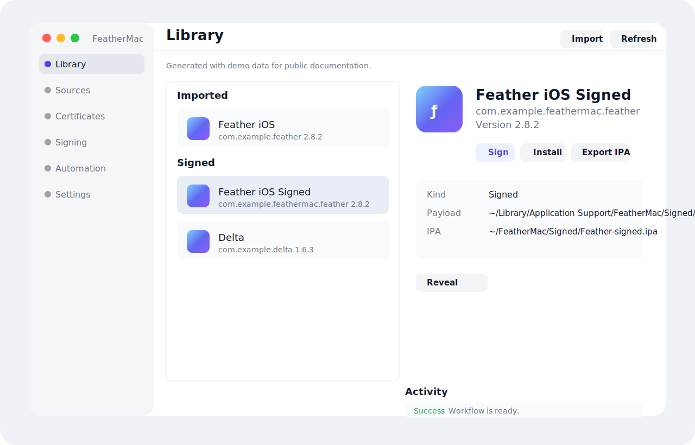
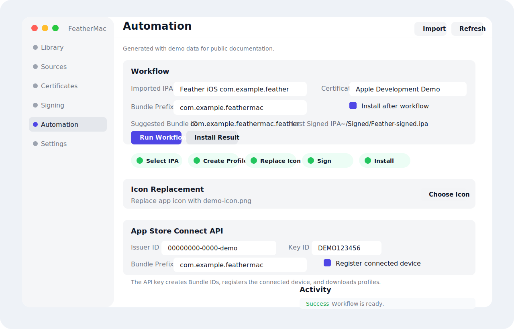
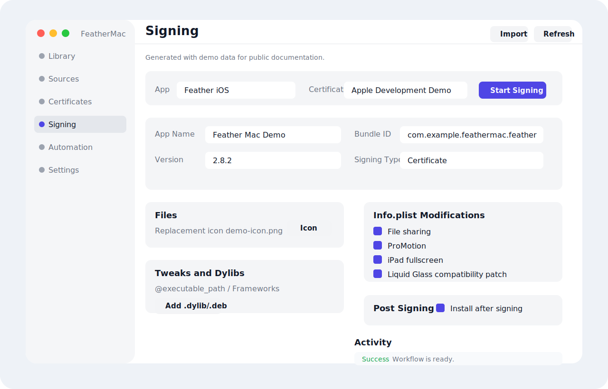
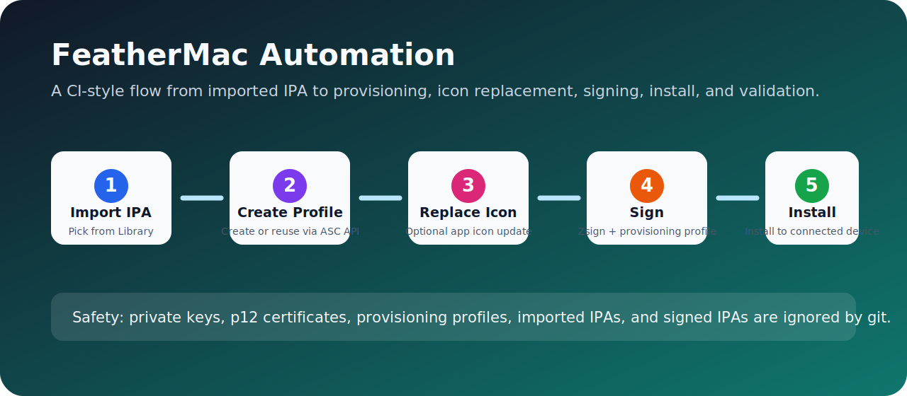

<p align="center">
  
</p>

<h1 align="center">FeatherMac</h1>

<p align="center">
  <strong>English</strong> | <a href="README.zh-CN.md">简体中文</a>
</p>

<p align="center">
  
  
  
</p>

FeatherMac is a native macOS IPA library, modification, signing, installation, and automation tool inspired by the Feather iOS workflow. It supports AltSource browsing, certificate management, IPA customization, Zsign-based signing, connected-device installation, App Store Connect provisioning automation, configuration export/import, iCloud Drive sync, and English/Simplified Chinese localization.

> Security note: this public repository intentionally excludes personal certificates, `.p12` files, `.p8` keys, provisioning profiles, imported IPA files, signed IPA files, and App Store Connect configuration exports.

## Screenshots

### Library



### Automation



### Signing



## Highlights

- Library: import IPA files, download apps from AltStore/SideStore sources, and inspect signed outputs.
- Sources: add, refresh, and parse AltSource repositories.
- Certificates: import `.p12` certificates and `.mobileprovision` profiles.
- IPA modification: change display name, bundle identifier, version, and app icon; remove Watch content; inject ElleKit.
- Signing and install: sign with Zsign and install to connected iOS devices.
- Automation: select an imported IPA, create or reuse a provisioning profile, replace the icon, sign, install, and validate from one page.
- App Store Connect API: create Bundle IDs, register the connected device, and generate development provisioning profiles.
- Configuration portability: export/import App Store Connect settings and sync them through iCloud Drive.
- Localization: English and Simplified Chinese are included.

## Automation Workflow



1. Import an IPA in Library.
2. Import your development `.p12` and provisioning profile in Certificates.
3. Configure App Store Connect Issuer ID, Key ID, and `.p8` private key path in Automation.
4. Set a bundle prefix such as `com.example`.
5. Select the imported IPA and certificate, then run the workflow.
6. FeatherMac creates or reuses a development profile, optionally replaces the icon, signs the app, and installs it on the connected iPhone.

## Requirements

- macOS 14 or later.
- Xcode 26.5 or a compatible version for CoreDevice and Developer Disk Image support.
- Swift 6.
- Recommended device tools:

```bash
brew install libimobiledevice ideviceinstaller
```

## Build

```bash
git clone https://github.com/TubeLiu/FeatherMac.git
cd FeatherMac
swift build
swift run FeatherMacSelfTest
./scripts/package_app.sh release
open dist/FeatherMac.app
```

`scripts/package_app.sh` creates `dist/FeatherMac.app` and applies an ad-hoc signature for local use.

## Security Notes

This repository intentionally ignores:

- `.p8` App Store Connect private keys
- `.p12` certificates
- `.mobileprovision` / `.provisionprofile` files
- imported and signed `.ipa` files
- `.feathermacconfig` exports
- local Application Support JSON state

Never commit personal signing material or App Store Connect credentials.

## Credits

- Feather iOS inspired the product workflow.
- Vendored `AltSourceKit` powers AltSource parsing.
- Vendored `Zsign` powers IPA re-signing.
- The OpenSSL Swift package is pulled in through Zsign.

## License

FeatherMac is released under GPL-3.0. Third-party code under `Vendor/` keeps its own license files.
