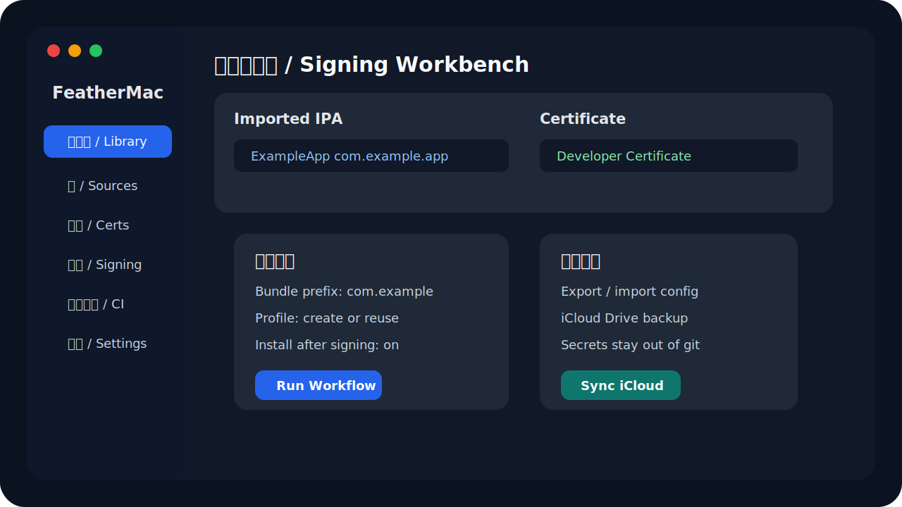

<p align="center">
  
</p>

<h1 align="center">FeatherMac</h1>

<p align="center">
  <strong>中文</strong> | <a href="#english">English</a>
</p>

<p align="center">
  
  
  
</p>



FeatherMac 是一个面向 macOS 的 IPA 管理、修改、签名和安装工具，目标是在 Mac 上提供类似 Feather iOS 版的工作流体验。它支持中文界面、AltStore 源解析、证书导入、IPA 修改、Zsign 签名、设备安装，以及类似 CI/CD 的自动配置流程。

> 安全说明：仓库不会包含任何个人证书、p12、p8、描述文件、签名 IPA、已导入 IPA 或 App Store Connect 配置。请永远不要把这些文件提交到公开仓库。

## 功能

- 资料库：导入 IPA、下载 AltStore/SideStore 源里的应用、查看已签名产物。
- 源管理：添加、刷新、解析 AltSource 仓库。
- 证书管理：导入 `.p12` 和 `.mobileprovision`，显示团队、过期时间和 App ID 信息。
- IPA 修改：修改应用名称、Bundle ID、版本号、图标，移除插件/Watch 内容，注入 ElleKit。
- 签名安装：使用 Zsign 重新签名 IPA，并通过 `libimobiledevice` / `ideviceinstaller` 安装到 iOS 设备。
- 自动配置：在一个页面内完成选择 IPA、创建/复用描述文件、替换图标、签名、安装。
- App Store Connect API：自动创建 Bundle ID、注册当前连接设备、生成开发描述文件。
- 配置迁移：导出/导入 App Store Connect 配置，并支持同步到 iCloud Drive。
- 本地化：内置 English 和简体中文。


## 系统要求

- macOS 14 或更新版本。
- Xcode 26.5 或兼容版本，用于 CoreDevice / Developer Disk Image 调试。
- Swift 6。
- Homebrew 推荐安装以下工具：

```bash
brew install libimobiledevice ideviceinstaller
```

## 构建

```bash
git clone https://github.com/TubeLiu/FeatherMac.git
cd FeatherMac
swift build
swift run FeatherMacSelfTest
./scripts/package_app.sh release
open dist/FeatherMac.app
```

`scripts/package_app.sh` 会生成 `dist/FeatherMac.app`，并使用 ad-hoc 签名，便于本地运行。

## 使用自动配置

1. 在“资料库”导入一个 IPA。
2. 在“证书”导入你的开发证书 `.p12` 和已有描述文件。
3. 在“自动配置”填写 App Store Connect API 的 Issuer ID、Key ID 和 `.p8` 私钥路径。
4. 设置 Bundle 前缀，例如 `com.example`。
5. 选择导入的 IPA 和证书，按“运行工作流”。
6. FeatherMac 会创建或复用描述文件、按需替换图标、签名，并安装到连接的 iPhone。

## App Store Connect 配置

FeatherMac 可以保存 API 设置到本机 Application Support，也可以导出为 `.feathermacconfig` 或同步到 iCloud Drive。该配置包含私钥内容，请像保护密码一样保护它。

推荐：

- 不要把 `.p8`、`.p12`、`.mobileprovision` 或 `.feathermacconfig` 上传到 GitHub。
- 给导出的配置文件设置受限权限。
- 定期轮换 App Store Connect API Key。

## 隐私和边界

FeatherMac 是本地工具。签名证书、私钥、导入的 IPA、签名产物、描述文件和 App Store Connect 配置默认存放在用户本机的 Application Support 或你选择的位置。公开仓库只包含源码和非敏感资源。

## 致谢

- Feather iOS 项目为功能体验提供了灵感。
- Vendored `AltSourceKit` 用于 AltSource 数据解析。
- Vendored `Zsign` 用于 IPA 重签名能力。
- OpenSSL Swift package 由 Zsign 依赖引入。

## 许可证

FeatherMac 以 GPL-3.0 发布。Vendor 目录中的第三方组件保留其各自许可证。

---

<a id="english"></a>

# FeatherMac

FeatherMac is a macOS IPA library, modification, signing, and installation tool inspired by the Feather iOS workflow. It provides a native Mac interface for AltSource browsing, certificate management, IPA customization, Zsign-based signing, device installation, and an automated CI-style provisioning workflow.

## Highlights

- Library: import IPA files, download apps from AltStore/SideStore sources, and inspect signed outputs.
- Sources: add, refresh, and parse AltSource repositories.
- Certificates: import `.p12` certificates and `.mobileprovision` profiles.
- IPA modification: change display name, bundle identifier, version, and app icon; remove Watch content; inject ElleKit.
- Signing and install: sign with Zsign and install to connected iOS devices.
- Automation: select an imported IPA, create or reuse a provisioning profile, replace the icon, sign, install, and validate from one page.
- App Store Connect API: create Bundle IDs, register the connected device, and generate development provisioning profiles.
- Configuration portability: export/import App Store Connect settings and sync them through iCloud Drive.
- Localization: English and Simplified Chinese are included.

## Requirements

- macOS 14 or later.
- Xcode 26.5 or a compatible version for CoreDevice and Developer Disk Image support.
- Swift 6.
- Recommended device tools:

```bash
brew install libimobiledevice ideviceinstaller
```

## Build

```bash
git clone https://github.com/TubeLiu/FeatherMac.git
cd FeatherMac
swift build
swift run FeatherMacSelfTest
./scripts/package_app.sh release
open dist/FeatherMac.app
```

## Automation Workflow

1. Import an IPA in Library.
2. Import your development `.p12` and provisioning profile in Certificates.
3. Configure App Store Connect Issuer ID, Key ID, and `.p8` private key path in Automation.
4. Set a bundle prefix such as `com.example`.
5. Select the imported IPA and certificate, then run the workflow.
6. FeatherMac creates or reuses a development profile, optionally replaces the icon, signs the app, and installs it on the connected iPhone.

## Security Notes

This repository intentionally ignores:

- `.p8` App Store Connect private keys
- `.p12` certificates
- `.mobileprovision` / `.provisionprofile`
- imported and signed `.ipa` files
- `.feathermacconfig` exports
- local Application Support JSON state

Never commit personal signing material or App Store Connect credentials.

## License

FeatherMac is released under GPL-3.0. Third-party code under `Vendor/` keeps its own license files.
