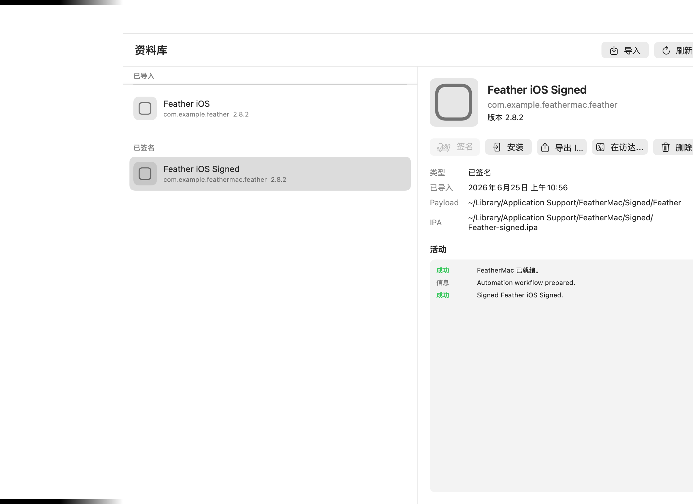
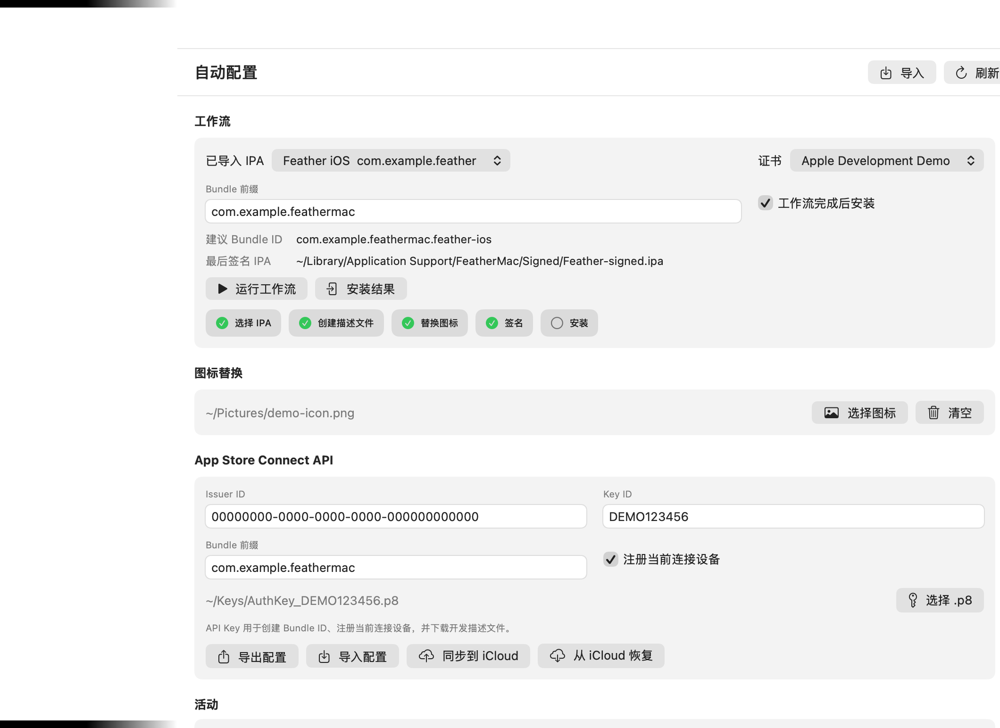
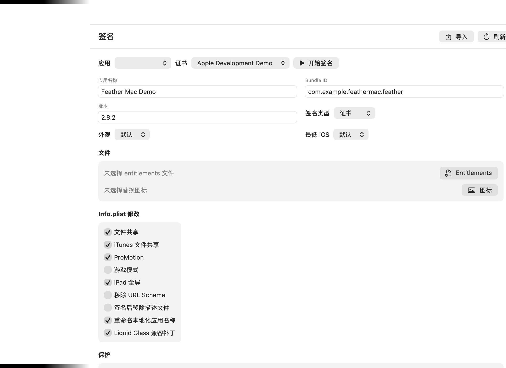
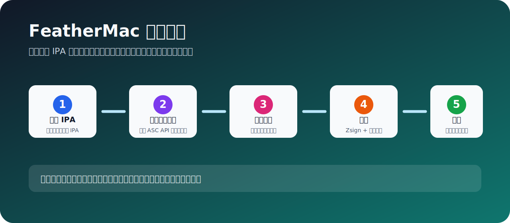

<p align="center">
  
</p>

<h1 align="center">FeatherMac</h1>

<p align="center">
  <a href="README.md">English</a> | <strong>简体中文</strong>
</p>

<p align="center">
  
  
  
</p>

FeatherMac 是一个面向 macOS 的 IPA 管理、修改、签名、安装和自动化工具，目标是在 Mac 上提供类似 Feather iOS 版的工作流体验。它支持 AltSource 浏览、证书导入、IPA 修改、Zsign 签名、连接设备安装、App Store Connect 自动创建描述文件、配置导入导出、iCloud Drive 同步，以及英文/简体中文界面。

## 产品截图

### 资料库



### 自动配置



### 签名



## 功能亮点

- 资料库：导入 IPA、下载 AltStore/SideStore 源里的应用、查看已签名产物。
- 源管理：添加、刷新、解析 AltSource 仓库。
- 证书管理：导入 `.p12` 和 `.mobileprovision`，显示团队、过期时间和 App ID 信息。
- IPA 修改：修改应用名称、Bundle ID、版本号、图标，移除插件/Watch 内容，注入 ElleKit。
- 签名安装：使用 Zsign 重新签名 IPA，并通过 `libimobiledevice` / `ideviceinstaller` 安装到 iOS 设备。
- 自动配置：在一个页面内完成选择 IPA、创建/复用描述文件、替换图标、签名、安装。
- App Store Connect API：自动创建 Bundle ID、注册当前连接设备、生成开发描述文件。
- 配置迁移：导出/导入 App Store Connect 配置，并支持同步到 iCloud Drive。
- 本地化：内置 English 和简体中文。

## 自动配置流程



1. 在“资料库”导入一个 IPA。
2. 在“证书”导入你的开发证书 `.p12` 和已有描述文件。
3. 在“自动配置”填写 App Store Connect API 的 Issuer ID、Key ID 和 `.p8` 私钥路径。
4. 设置 Bundle 前缀，例如 `com.example`。
5. 选择导入的 IPA 和证书，按“运行工作流”。
6. FeatherMac 会创建或复用描述文件、按需替换图标、签名，并安装到连接的 iPhone。

## 系统要求

- macOS 14 或更新版本。
- Xcode 26.5 或兼容版本，用于 CoreDevice / Developer Disk Image 调试。
- Swift 6。
- 推荐通过 Homebrew 安装设备工具：

```bash
brew install libimobiledevice ideviceinstaller
```

## 构建

```bash
git clone https://github.com/TubeLiu/FeatherMac.git
cd FeatherMac
swift build
swift run FeatherMacSelfTest
./scripts/package_app.sh release
open dist/FeatherMac.app
```

`scripts/package_app.sh` 会生成 `dist/FeatherMac.app`，并使用 ad-hoc 签名，便于本地运行。

## 致谢

- Feather iOS 项目为产品工作流提供了灵感。
- Vendored `AltSourceKit` 用于 AltSource 数据解析。
- Vendored `Zsign` 用于 IPA 重签名能力。
- OpenSSL Swift package 由 Zsign 依赖引入。

## 许可证

FeatherMac 以 GPL-3.0 发布。`Vendor/` 目录中的第三方组件保留其各自许可证。
