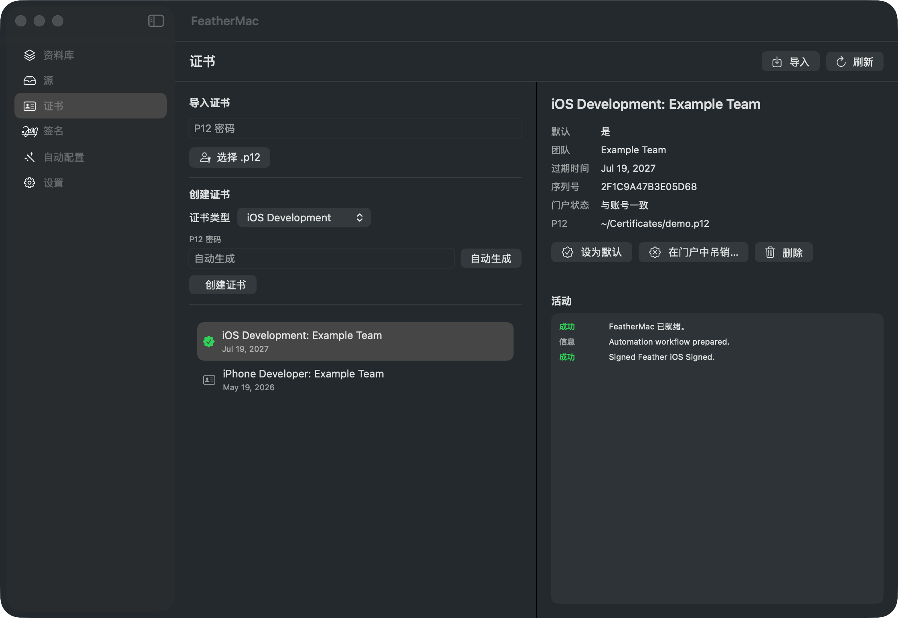

<p align="center">
  
</p>

<h1 align="center">FeatherMac</h1>

<p align="center">
  <a href="README.md">English</a> | <strong>简体中文</strong>
</p>

<p align="center">
  
  
  
</p>

<p align="center">
  在一个 Mac 原生应用里完成 iOS 应用签名与安装，不用打开 Xcode。
</p>

<p align="center">
  <a href="https://github.com/TubeLiu/FeatherMac/releases/latest"><strong>下载最新版本</strong></a>
</p>

---

如果你有付费的 Apple 开发者账号，又常给自己的 iPhone 侧载应用，大概熟悉这套流程：开 Xcode 建证书，去开发者后台建 Bundle ID，注册设备，下载描述文件，找个签名工具，再找个安装工具。六个地方，彼此不通气。

FeatherMac 把整条链收进一个窗口。导入 IPA，它会创建证书、注册设备、生成描述文件、签名、安装——每一步都摆在你眼前。

**这个软件是给已经付费加入 Apple Developer Program 的人用的。** 证书通过苹果的 App Store Connect API 申请，而免费账号（Personal Team）用不了这个接口。如果你想找的是用免费 Apple ID 做 7 天签名，这不是那类工具。

## 界面

### 证书

不用打开 Xcode 就能申请、续期、吊销签名证书。每张证书都显示序列号，以及它在苹果账号里是否还存在。



### 自动配置


### 资料库


### 签名


## 主要能力

- **不用 Xcode 也能搞定证书。** 在应用里直接申请 iOS 开发证书，私钥在本机生成、全程不出本机，上传的只有证书请求。撞上苹果的证书数量上限时，它会列出你已有的证书，让你确认吊销一张后继续。证书过期则是一键续期。
- **能提前拦住错误的配置向导。** 连接苹果账号只需四步。Key ID 从 `AuthKey_*.p8` 文件名自动读出，文件在发给苹果之前先本地校验；苹果拒绝你的凭据时，它会告诉你三项里哪一项不对，而不是甩一个原始错误码。
- **多把 API 密钥随时切换。** 跨账号或跨团队时有用。密钥文件复制进 FeatherMac 自己的数据目录并设为仅本人可读，之后清理"下载"文件夹不会让签名失效。
- **从 IPA 到装进手机，一次点击。** "自动配置"页把整套流程跑完：选应用、创建或复用描述文件、替换图标、签名、安装。证书续期之后重签也还是这一次点击。另有 `--workflow` 命令行模式便于脚本化。
- **真正会用到的签名选项。** 改应用名、改 Bundle ID、换图标、注入插件与 dylib、开关 Info.plist 能力、移除 URL Scheme。
- **软件源。** 浏览 AltStore 风格的源目录与 APT 仓库，下载应用，每次签名的产物都留着，随时可重装。
- **凭据存放得当。** p12 密码存进钥匙串而非配置文件——别人拿到 `cert.p12` 没有密码也打不开。数据目录仅本人可读。导出配置前会先提示：文件里以明文内嵌着你的 API 私钥。
- **全程中英双语。**

## 自动配置流程


1. 在**资料库**导入 IPA。
2. 在**自动配置**页跑一遍 App Store Connect 配置向导，导入你的 `.p8` 密钥。
3. 在**证书**页申请一张开发证书——或者导入已有的 `.p12`。
4. 设置 Bundle 前缀，例如 `com.example`。
5. 选好 IPA 与证书，运行工作流。

FeatherMac 会创建或复用开发描述文件、注册已连接设备、按需替换图标、签名，并安装到你的 iPhone。

## 环境要求

- macOS 14 或更高版本
- 付费的 Apple Developer Program 账号
- 安装到设备所需的工具：

```bash
brew install libimobiledevice ideviceinstaller
```

## 从源码构建

```bash
git clone https://github.com/TubeLiu/FeatherMac.git
cd FeatherMac
swift build
swift run FeatherMacSelfTest
./scripts/package_app.sh release
open dist/FeatherMac.app
```

`scripts/package_app.sh` 会在钥匙串里找 Developer ID Application 身份，找到就用它签名，找不到则退回 ad-hoc 自签。ad-hoc 版本在本机能跑，但别人下载后会被 Gatekeeper 拦住。

要做出别人下载后双击就能打开的版本，加上公证：

```bash
NOTARIZE=1 ./scripts/package_app.sh release
```

公证直接复用 FeatherMac 里已配置的 App Store Connect API 密钥，不需要 app 专用密码。

文档截图由铺好的演示数据生成，不会截到任何真实账号信息：

```bash
./scripts/capture_screenshots.sh
```

## 不包含

- 免费 Apple ID 签名（7 天那种）——App Store Connect API 不对免费账号开放
- 发布（Distribution）证书与上架 App Store
- 无线安装，设备需通过 USB 连接

## 致谢

- 产品流程参考了 Feather iOS。
- 内置的 `AltSourceKit` 负责解析 AltSource。
- 内置的 `Zsign` 负责 IPA 重签名。
- OpenSSL Swift 包通过 Zsign 引入。

## 许可证

FeatherMac 以 GPL-3.0 发布。`Vendor/` 下的第三方代码保留各自的许可证文件。
